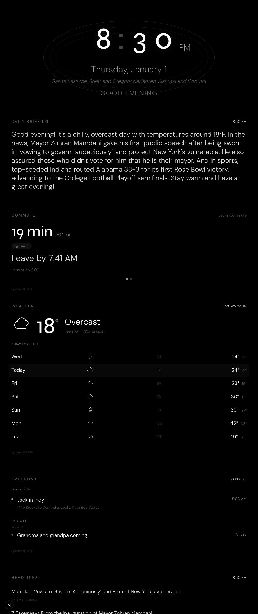
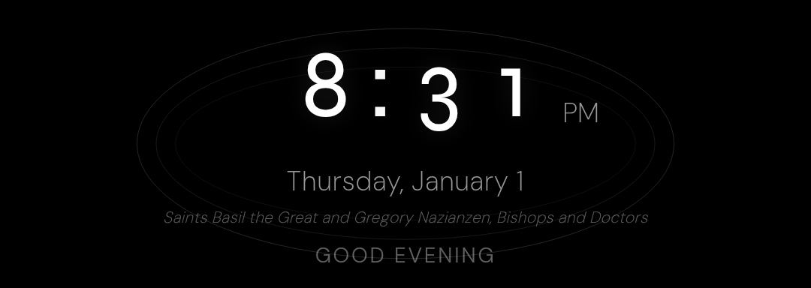
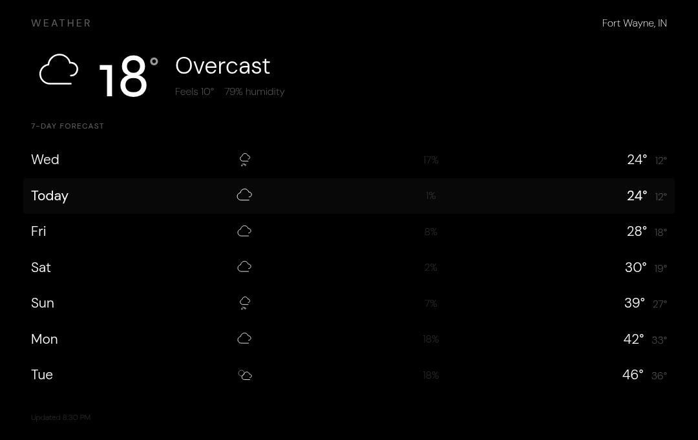

# Magic Mirror

[](https://github.com/jjones-wps/jjones-magic-mirror/actions/workflows/deploy.yml)

A smart magic mirror display built with Next.js, designed for a 1080x2560 portrait display running on a Raspberry Pi.

## Features

- **Clock** - Large time display with animated digit transitions
- **Weather** - Current conditions and hourly forecast via Open-Meteo
- **Calendar** - Events from iCal feeds (iCloud, Google, etc.)
- **News** - Headlines with RSS feed parsing
- **AI Daily Briefing** - Personalized morning summary via OpenRouter
- **Spotify Now Playing** - Currently playing track with OAuth integration
- **Catholic Feast Days** - Liturgical calendar via romcal
- **Commute Times** - Traffic-aware routing via TomTom (workday mornings)

## Screenshots

<!-- TODO: Add screenshots once captured from Raspberry Pi -->
<!-- See public/screenshots/README.md for capture instructions -->

### Full Mirror Display

<!--  -->

**Coming soon:** Full 1080x2560 portrait display showing all widgets in action.

### Feature Highlights

<table>
<tr>
<td width="33%">

**Clock Widget**
<!--  -->

*Animated digit transitions with "Waterfall of Time" effect*

</td>
<td width="33%">

**Weather Widget**
<!--  -->

*Current conditions and 24-hour forecast*

</td>
<td width="33%">

**Calendar Widget**
<!--  -->

*Today's events, tomorrow's preview*

</td>
</tr>
<tr>
<td width="33%">

**AI Summary**
<!--  -->

*Personalized morning briefing*

</td>
<td width="33%">

**Spotify Now Playing**
<!--  -->

*Real-time track display*

</td>
<td width="33%">

**Commute Times**
<!--  -->

*Traffic-aware departure times*

</td>
</tr>
</table>

### Animated Demos

<!-- TODO: Add GIF demos once recorded -->
<!-- See public/demos/README.md for recording instructions -->

**Clock Digit Transitions**
<!--  -->

*Smooth "Waterfall of Time" animation as digits change*

**Auto-Refresh on Deploy**
<!--  -->

*Seamless updates when new versions are deployed*

---

## Documentation

Comprehensive documentation is available in the [`docs/`](docs/) directory:

- **[Documentation Hub](docs/README.md)** - Start here for guided navigation
- **[API Documentation](docs/API_DOCUMENTATION.md)** - Complete API reference
- **[Architecture](docs/ARCHITECTURE.md)** - System design and diagrams
- **[Testing Guide](docs/TESTING.md)** - Test coverage and patterns
- **[Troubleshooting](docs/TROUBLESHOOTING.md)** - Deployment issue solutions
- **[Design System](docs/design/DESIGN_SYSTEM.md)** - UI/UX guidelines

See [CLAUDE.md](CLAUDE.md) for AI-assisted development guidance.

## Tech Stack

- **Framework**: Next.js 16 with App Router
- **Styling**: Tailwind CSS 4 + custom design system
- **Animations**: Framer Motion
- **Calendar Parsing**: node-ical
- **Liturgical Calendar**: romcal
- **Date Utilities**: date-fns

## Design System

The "Quiet Presence" design follows strict minimalist principles:

- Pure monochrome (white on black)
- Hierarchy through opacity levels
- GPU-accelerated animations only (transform + opacity)
- Optimized for Raspberry Pi performance

## Getting Started

### Prerequisites

- Node.js 22+
- npm

### Installation

```bash
# Clone the repository
git clone https://github.com/yourusername/jjones-magic-mirror.git
cd jjones-magic-mirror

# Install dependencies
npm install

# Copy environment template
cp .env.example .env.local
# Edit .env.local with your API keys and configuration

# Start development server
npm run dev
```

Open [http://localhost:3000](http://localhost:3000) to view the mirror.

## Environment Variables

Create a `.env.local` file based on `.env.example`:

```bash
cp .env.example .env.local
```

Then configure the following variables:

### Required

```bash
# Calendar (iCal feeds from iCloud, Google, etc.)
CALENDAR_URL_PRIMARY=https://...
CALENDAR_URL_SECONDARY=https://...

# Weather location (get coordinates from latlong.net)
WEATHER_LAT=41.0793
WEATHER_LON=-85.1394
WEATHER_LOCATION=Fort Wayne, IN

# AI Summary (get API key from openrouter.ai)
OPENROUTER_API_KEY=sk-or-v1-...
OPENROUTER_MODEL=anthropic/claude-3-haiku
```

### Optional Features

```bash
# Spotify Now Playing (create app at developer.spotify.com)
SPOTIFY_CLIENT_ID=...
SPOTIFY_CLIENT_SECRET=...

# Traffic-Aware Commute Times (get key from developer.tomtom.com)
TOMTOM_API_KEY=...
COMMUTE_1_NAME=Person1
COMMUTE_1_ORIGIN=41.0454,-85.1455        # lat,lon coordinates
COMMUTE_1_DESTINATION=41.1327,-85.1762
COMMUTE_1_ARRIVAL_TIME=08:00             # 24-hour format
# ... (COMMUTE_2_* variables available)

# Admin Portal (requires authentication setup)
NEXTAUTH_SECRET=<generate with: openssl rand -base64 32>
NEXTAUTH_URL=http://localhost:3000
ADMIN_EMAIL=admin@example.com
ADMIN_PASSWORD_HASH=<generate with bcryptjs>
```

See `.env.example` for complete configuration with detailed comments.

## Scripts

```bash
npm run dev      # Start development server
npm run build    # Production build
npm run start    # Start production server
npm run lint     # Run ESLint
```

## Raspberry Pi Deployment

The mirror runs on a Raspberry Pi with pm2 process manager and **automated push-to-deploy** via GitHub Actions.

### Deploy Changes

Just push to main - deployment is automatic:

```bash
git push origin main
```

A self-hosted GitHub Actions runner on the Pi will:

1. Pull latest from git
2. Install dependencies
3. Build for production
4. Restart the pm2 server
5. Verify health

Monitor deploys at the [Actions tab](https://github.com/jjones-wps/jjones-magic-mirror/actions).

### Auto-Refresh

The `VersionChecker` component polls for version changes and automatically refreshes the display when updates are deployed.

## Project Structure

```
src/
├── app/
│   ├── api/           # Server-side API routes
│   │   ├── calendar/  # iCal feed parser
│   │   ├── commute/   # TomTom traffic routing
│   │   ├── feast-day/ # Catholic liturgical calendar
│   │   ├── news/      # RSS news headlines
│   │   ├── spotify/   # Spotify OAuth + now-playing
│   │   ├── summary/   # AI daily briefing
│   │   ├── version/   # Build version for auto-refresh
│   │   └── weather/   # Weather data proxy
│   ├── globals.css    # Design system + utilities
│   ├── layout.tsx     # Root layout with fonts
│   └── page.tsx       # Main mirror composition
├── components/
│   └── widgets/       # Display widgets
└── lib/               # Utilities and types
```

## License

MIT
