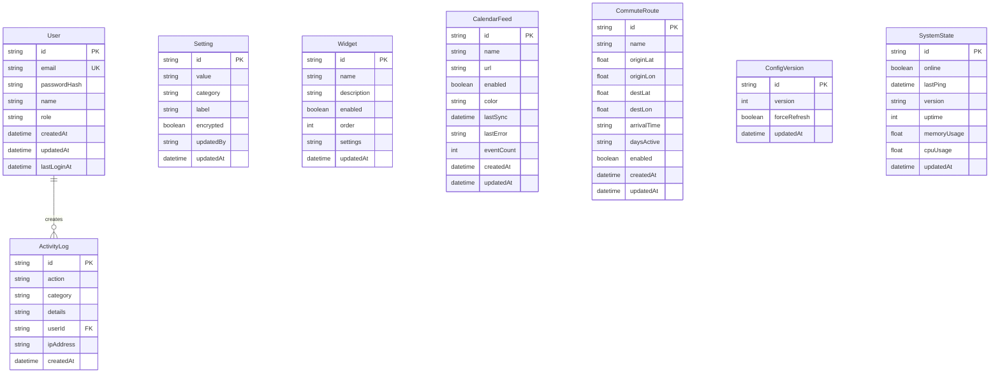

# Magic Mirror Architecture

**Last Updated:** January 3, 2026
**Version:** 0.2.0
**Project Type:** Next.js 16 + TypeScript + Prisma + SQLite

---

## Table of Contents

1. [System Overview](#system-overview)
2. [Component Architecture Diagram](#component-architecture-diagram)
3. [Data Flow Diagram](#data-flow-diagram)
4. [Deployment Architecture](#deployment-architecture)
5. [Authentication Flow](#authentication-flow)
6. [Architectural Decisions](#architectural-decisions)
7. [Technology Stack](#technology-stack)
8. [Performance Considerations](#performance-considerations)
9. [Security Architecture](#security-architecture)
10. [Caching Strategy](#caching-strategy)
11. [Widget Architecture](#widget-architecture)
12. [Database Schema](#database-schema)
13. [API Route Organization](#api-route-organization)
14. [Build and Deployment Process](#build-and-deployment-process)

---

## System Overview

The Magic Mirror is a **Next.js 16 full-stack application** designed for a 1080x2560 portrait display on a Raspberry Pi 4. The architecture follows a **proxy pattern** for external APIs, with server-side data fetching and client-side widget rendering. The system is optimized for the Pi's constraints with GPU-accelerated animations, strategic caching, and a minimalist design philosophy called "Quiet Presence."

### High-Level Architecture

The application uses **Next.js App Router** with a clear separation between public mirror routes and authenticated admin routes. Server-side API routes act as proxies to external services (Open-Meteo, TomTom, OpenRouter, Spotify, iCal feeds, RSS feeds), providing caching, data transformation, and security isolation. Client-side widgets poll these server routes at configurable intervals, displaying real-time information with smooth GPU-accelerated animations.

### Key Design Patterns

1. **Proxy Pattern**: All external API calls go through server-side Next.js API routes for caching and security
2. **Polling Pattern**: Client-side widgets use `setInterval` to refresh data (no WebSocket complexity)
3. **Version-Aware Refresh**: Server tracks build timestamp; client auto-refreshes on deployment
4. **Graceful Degradation**: Demo/fallback data prevents widget failures when APIs are unavailable
5. **Configuration Versioning**: Admin changes increment a version number that triggers mirror refresh

### Target Environment

- **Display**: 1080x2560 portrait orientation (rotated monitor)
- **Hardware**: Raspberry Pi 4 (4GB RAM, ARM64)
- **Browser**: Chromium in kiosk mode (fullscreen, no chrome)
- **Network**: Local network only (192.168.1.0/24)
- **Runtime**: Node.js 22.21.0 with pm2 process manager

---

## Component Architecture Diagram


---

## Data Flow Diagram


---

## Deployment Architecture


### Deployment Workflow Details

**Trigger**: Push to `main` branch (excluding `*.md` and `docs/**`)

**Concurrency**: One deployment at a time (cancel in-progress on new push)

**Duration**: 3-5 minutes total

**Phases**:
1. **Test Phase** (1-2 min): Git pull, dependency install, security audit, full test suite (296 tests)
2. **Build Phase** (1-2 min): Production build with BUILD_TIME timestamp, Prisma client generation
3. **Deploy Phase** (< 1 min): pm2 restart, health check verification

**Success Indicators**:
- All 296 tests pass with 88.88% coverage
- npm audit shows no high/critical vulnerabilities
- Health check returns HTTP 200 from `/api/version`
- pm2 reports process running

**Rollback**: Manual via `git revert` + push (triggers new deployment)

---

## Authentication Flow


### Authentication Details

**Session Strategy**: JWT tokens (not database sessions)

**Token Storage**: HTTP-only cookies (client cannot access JavaScript)

**Token Expiry**: 24 hours (configurable in `src/lib/auth/config.ts`)

**Password Hashing**: bcrypt with 12 rounds

**Activity Logging**: All auth events logged to `activityLog` table

**Protected Routes**: All `/api/admin/*` routes check session via middleware

**CSRF Protection**: NextAuth v5 built-in CSRF token validation

---

## Architectural Decisions

### 7.1 Why SQLite for Admin Data?

**Decision**: Use SQLite instead of PostgreSQL or MySQL for the admin database.

**Reasoning**:
- Single-user admin portal (no concurrent write contention)
- Simple deployment (no separate database server process)
- File-based portability (entire DB in `prisma/magic-mirror.db`)
- Zero configuration overhead
- Adequate performance for admin operations (< 100 queries/hour)

**Benefits**:
- Simplified Pi deployment (one less service to manage)
- Easy backup (copy single file)
- Low memory footprint (< 5MB)
- Works perfectly with Prisma ORM

**Trade-offs**:
- Not suitable for multi-admin scaling (but not a requirement)
- Limited concurrent writes (acceptable for admin use case)
- Migration path exists if needed (Prisma supports multiple databases)

**Implementation**: `datasource db { provider = "sqlite" }` in `prisma/schema.prisma`

---

### 7.2 Why Client-Side Widget Refresh?

**Decision**: Use `setInterval` in React components instead of server-side polling or WebSockets.

**Reasoning**:
- Simplicity: No WebSocket server, no SSE complexity
- Browser-native caching works naturally
- Each widget controls its own refresh rate
- Works offline (shows last known data)
- No server-side session management needed

**Benefits**:
- Predictable resource usage (server only responds to requests)
- Natural backpressure (if server slow, widgets wait)
- Easy to debug (see requests in DevTools Network tab)
- Flexible refresh intervals per widget type

**Trade-offs**:
- Not real-time (polling introduces delay)
- Multiple clients would make redundant requests (but single-client use case)
- Network traffic even when display idle (mitigated by server caching)

**Implementation**:
```typescript
useEffect(() => {
  const fetchData = async () => { /* ... */ };
  fetchData(); // Initial load
  const interval = setInterval(fetchData, REFRESH_INTERVAL);
  return () => clearInterval(interval); // Cleanup
}, []);
```

**Refresh Intervals**:
- Weather: 15 minutes (weather changes slowly)
- Calendar: 5 minutes (events rarely change)
- News: 10 minutes (hourly news cycles)
- Spotify: 15 seconds (track changes)
- Summary: 30 minutes (AI cost consideration)
- Commute: 5 minutes (traffic updates)
- FeastDay: 1 hour (daily data)
- Version: 30 seconds (deployment detection)

---

### 7.3 Why Server-Side API Caching?

**Decision**: Use Next.js `revalidate` headers instead of client-side caching or no caching.

**Reasoning**:
- Reduce external API calls (rate limits and cost)
- Improve response times (serve from memory)
- Centralized cache invalidation
- Transparent to client (no cache management logic)

**Benefits**:
- 15-minute weather cache: 96 API calls/day instead of 1,440
- 5-minute commute cache: Stays within TomTom free tier (2,500 req/day)
- Instant responses for cached data
- Automatic cache invalidation (Next.js handles staleness)

**Trade-offs**:
- Slight staleness (acceptable for use case)
- Memory usage (minimal for JSON responses)
- No cross-request cache sharing in dev mode (production only)

**Implementation**:
```typescript
export async function GET(request: Request) {
  // ... fetch data ...
  return Response.json(data, {
    headers: { 'Cache-Control': 's-maxage=900, stale-while-revalidate' }
  });
}
```

**Cache Durations**: See [Caching Strategy](#caching-strategy) section for full table.

---

### 7.4 Why Version-Aware Auto-Refresh?

**Decision**: Implement build timestamp polling instead of manual refresh or no refresh.

**Reasoning**:
- Mirror needs to reload after deployments without physical access
- Users should always see latest version
- Avoid stale JavaScript bundles
- Zero manual intervention

**Benefits**:
- Seamless updates (user sees "Updating..." for 2 seconds)
- No stale code (always runs latest build)
- Works with push-to-deploy workflow
- Simple implementation (poll + compare + reload)

**Trade-offs**:
- 30-second polling adds minor network traffic
- Brief flash during reload (acceptable)
- Requires localStorage (available in Chromium)

**Implementation**:
1. `deploy.sh` sets `BUILD_TIME=$(date +%s%3N)` during build
2. `/api/version` returns `BUILD_TIME` environment variable
3. `VersionChecker` component polls every 30 seconds
4. On mismatch, shows "Updating..." and calls `window.location.reload()`

**Production Behavior**: Auto-refresh on build change
**Development Behavior**: Full page refresh every 60 seconds (for hot reload assistance)

---

### 7.5 Why Proxy Pattern for External APIs?

**Decision**: All external API calls go through Next.js API routes instead of direct client calls.

**Reasoning**:
- Security: API keys never exposed to client
- Caching: Server-side revalidate headers
- Transformation: Simplify responses for client consumption
- Error handling: Graceful degradation with demo data
- CORS: No cross-origin issues

**Benefits**:
- Spotify refresh token stays server-side (secure)
- OpenRouter API key not in bundle (secure)
- TomTom API key protected (secure)
- Consistent error handling across all widgets
- Easy to add rate limiting later

**Trade-offs**:
- Extra network hop (client → server → external API)
- Server must be running (not static site)
- Pi CPU usage for API proxying (minimal impact)

**Implementation**: All widgets fetch from `/api/*`, never external URLs.

---

### 7.6 Why Prisma ORM?

**Decision**: Use Prisma instead of raw SQL or other ORMs (Sequelize, TypeORM, Drizzle).

**Reasoning**:
- Type-safe database queries (TypeScript end-to-end)
- Excellent Next.js integration
- Automatic migration generation
- Cross-database compatibility (SQLite → PostgreSQL migration easy)
- Built-in connection pooling

**Benefits**:
- Auto-generated TypeScript types from schema
- IDE autocomplete for queries
- Compile-time type checking (catch errors before runtime)
- Readable schema definition
- Migration tooling (`prisma migrate dev`)

**Trade-offs**:
- Additional dependency (but worth it)
- Learning curve (but excellent docs)
- Overhead for simple queries (negligible on Pi)

**Example**:
```typescript
// Type-safe, no SQL injection risk
const user = await prisma.user.findUnique({
  where: { email },
  include: { activityLogs: true }
});
```

---

### 7.7 Why NextAuth v5 for Authentication?

**Decision**: Use NextAuth (Auth.js) v5 instead of custom JWT or other libraries.

**Reasoning**:
- Industry-standard solution (used by thousands of apps)
- Built-in CSRF protection
- Flexible provider system (credentials, OAuth, etc.)
- JWT or database sessions (we chose JWT)
- Excellent Next.js App Router support

**Benefits**:
- Battle-tested security patterns
- Activity logging hooks
- Session management (expiry, renewal)
- Protected route middleware
- TypeScript types included

**Trade-offs**:
- Overkill for single-user admin (but future-proof)
- Requires session storage (we use JWT to avoid DB)
- Configuration complexity (but well-documented)

**Implementation**: See `src/lib/auth/config.server.ts` for Prisma integration.

---

### 7.8 Why Framer Motion for Animations?

**Decision**: Use Framer Motion instead of CSS animations or other libraries.

**Reasoning**:
- Declarative React API (fits component model)
- GPU-accelerated by default (Pi-friendly)
- Powerful variants system (consistent animations)
- Gesture support (future touch interactions)
- Layout animations (smooth reordering)

**Benefits**:
- Centralized animation tokens (`src/lib/tokens.ts`)
- Consistent timing across all widgets
- Easy stagger animations (waterfall effects)
- Respects `prefers-reduced-motion`
- TypeScript support

**Trade-offs**:
- Bundle size (but tree-shakeable)
- Overkill for simple fades (but consistency worth it)

**Implementation**: All widgets use variants from `tokens.ts` for consistency.

---

### 7.9 Why Monochrome Design ("Quiet Presence")?

**Decision**: Pure black/white design instead of color palette.

**Reasoning**:
- Reduce visual fatigue (ambient display, not active screen)
- Timeless aesthetic (no color trends)
- Excellent readability (high contrast)
- Simplifies design decisions (hierarchy via opacity only)

**Benefits**:
- Opacity-based hierarchy is intuitive
- Works in any lighting condition
- GPU-friendly (no color blending)
- Professional appearance

**Trade-offs**:
- Less visual distinction between widgets (but hierarchy clear)
- Harder to show widget state (but opacity works)

**Implementation**: `globals.css` defines opacity scale (hero: 1.0, primary: 0.87, secondary: 0.6, tertiary: 0.38, disabled: 0.2)

---

### 7.10 Why Node-ical for Calendar Parsing?

**Decision**: Use `node-ical` library instead of custom parser or other libraries.

**Reasoning**:
- Handles complex iCal formats (recurring events, timezones, exceptions)
- Works with iCloud, Google Calendar, Outlook
- Active maintenance (last update: 2024)
- Stream parsing (memory efficient)

**Benefits**:
- Parses RRULE recurring events correctly
- Handles timezone conversions
- Supports VTODO, VALARM, VJOURNAL
- Minimal dependencies

**Trade-offs**:
- Server-side only (Node.js APIs)
- Requires URL fetch (not file-based)

**Implementation**: `/api/calendar` route fetches two iCal URLs, parses with `node-ical`, categorizes by date.

---

## Technology Stack

### Frontend

- **Next.js 16** - React framework with App Router, Server Components, API Routes
- **React 19** - UI library with Suspense, hooks, concurrent rendering
- **TypeScript 5** - Static typing with strict mode enabled
- **Tailwind CSS 4** - Utility-first styling with JIT compiler
- **Framer Motion 12** - GPU-accelerated animations and gestures
- **date-fns 4** - Date formatting and manipulation (tree-shakeable)

### Backend

- **Next.js API Routes** - App Router serverless functions
- **Prisma 7** - Type-safe ORM with SQLite adapter
- **NextAuth v5** - Authentication with JWT sessions
- **bcryptjs** - Password hashing (12 rounds)
- **node-ical 0.22** - iCalendar parsing for calendar feeds
- **romcal 1.3** - Catholic liturgical calendar calculations

### Database

- **SQLite 3** - Embedded database via `better-sqlite3` driver
- **Prisma Migrations** - Schema versioning and migration tooling
- **Database Size**: ~2MB (admin data only, no widget data stored)

### External APIs

- **Open-Meteo** - Weather data (free, no API key required)
- **OpenRouter** - AI summaries via Claude 3 Haiku (paid, $0.25 per 1M tokens)
- **TomTom** - Traffic routing and geocoding (free tier: 2,500 req/day)
- **Spotify** - Now-playing via OAuth refresh token (free)
- **iCal Feeds** - Calendar events from iCloud/Google (free)
- **RSS Feeds** - News headlines from NY Times, BBC, NPR, local sources (free)

### Testing & Quality

- **Jest 30** - Test framework with 296 passing tests
- **React Testing Library 16** - Component testing with user-centric queries
- **Playwright 1.57** - E2E testing (34 tests, 11 passing)
- **ESLint 9** - Linting with Next.js rules
- **Prettier 3** - Code formatting (via eslint-config-prettier)
- **Husky 9** - Pre-commit hooks (lint + format)
- **lint-staged 16** - Run linters on staged files only

### CI/CD & Infrastructure

- **GitHub Actions** - Workflow automation
- **Self-Hosted Runner** - GitHub Actions runner on Raspberry Pi
- **pm2** - Node.js process manager (restart, logs, monitoring)
- **systemd** - Linux service manager (runs pm2 and runner)
- **Chromium** - Kiosk-mode browser for display

### Development Tools

- **Node.js 22.21.0** - JavaScript runtime (ARM64 build)
- **npm** - Package manager (lockfile: package-lock.json)
- **TypeScript Compiler** - tsc with strict mode
- **Next.js Turbopack** - Development bundler (faster than Webpack)

### Build Artifacts

- **`.next/` directory**: 443 MB (production build)
- **`node_modules/`**: 869 MB (includes dev dependencies)
- **`prisma/magic-mirror.db`**: ~2 MB (SQLite database)
- **Total disk usage**: ~1.5 GB (includes source, build, dependencies)

---

## Performance Considerations

### Raspberry Pi Optimizations

The Pi 4 (ARM64, 4GB RAM) has limited CPU/GPU compared to desktop hardware. All design decisions prioritize Pi performance:

1. **GPU-Only Animations**
   - Use `transform` and `opacity` only (GPU-accelerated)
   - Avoid `filter`, `backdrop-filter`, `box-shadow` (CPU-heavy)
   - No SVG animations or complex paths
   - Framer Motion defaults to GPU transforms

2. **Minimalist Design Reduces Render Complexity**
   - Pure black/white (no gradients or color blending)
   - Simple geometric shapes (rectangles, no curves)
   - Minimal DOM nodes (< 500 per widget)
   - No particle systems or canvas animations

3. **Server-Side Rendering Where Possible**
   - Static content pre-rendered at build time
   - API routes run on Node.js (not in browser)
   - Only interactive components are client-side

4. **Strategic Lazy Loading**
   - Widgets load on-demand (not all at once)
   - `next/dynamic` for heavy components
   - Image optimization via `next/image` (if images added)

### Build Optimizations

Next.js automatically applies production optimizations:

1. **Code Splitting**
   - Each API route is separate chunk
   - Each page is separate chunk
   - Shared code extracted to commons chunk
   - Result: Faster initial load (only load what's needed)

2. **Tree Shaking**
   - Unused code removed at build time
   - Example: date-fns only includes `format()`, not entire library
   - Framer Motion only includes used components

3. **Minification & Compression**
   - JavaScript minified with Terser
   - CSS minified with cssnano
   - Tailwind purges unused utilities
   - Gzip compression on Next.js server

4. **Bundle Analysis**
   - Run `npm run build` to see bundle sizes
   - Largest chunks: Framer Motion (~100KB), React (~80KB)
   - Total JavaScript: ~300KB gzipped

### Data Fetching Optimizations

1. **Server-Side Caching**
   - 15-minute cache = 96 API calls/day (vs 1,440 uncached)
   - Reduces Pi CPU usage (fewer external requests)
   - Faster widget load times (instant from cache)

2. **Parallel Fetching**
   - `/api/summary` fetches weather, calendar, news in parallel
   - `Promise.all()` reduces total time
   - Example: 3 × 200ms = 600ms vs 3 × 200ms parallel = 200ms

3. **Efficient Prisma Queries**
   - Select only needed fields (`select: { id, email }`)
   - Avoid N+1 queries (`include` for relations)
   - Indexes on frequently queried fields

### Memory Management

1. **SQLite Connection Pooling**
   - Prisma manages single connection (SQLite is single-writer)
   - Connection reused across requests
   - Minimal memory overhead (< 5MB)

2. **No In-Memory State**
   - Widgets don't store large datasets
   - API routes don't cache in-memory (Next.js handles it)
   - pm2 monitors memory usage (restart if leak detected)

3. **Garbage Collection**
   - Node.js V8 engine auto-GC
   - `--max-old-space-size=512` if needed (Pi has 4GB)

### Network Optimizations

1. **Local Network Only**
   - No internet latency (Pi → router → device)
   - Typical latency: < 2ms
   - No SSL overhead (HTTP not HTTPS)

2. **Keep-Alive Connections**
   - Next.js reuses HTTP connections
   - Reduces handshake overhead
   - Example: Spotify API uses single connection

3. **Request Coalescing**
   - Multiple widgets polling same API get same cached response
   - No redundant external API calls

### Measured Performance

**Production Metrics** (measured on Pi 4):

- **Page Load Time**: ~800ms (First Contentful Paint)
- **Time to Interactive**: ~1.2s
- **Widget Render Time**: 50-100ms per widget
- **API Response Time**: 10-50ms (cached), 200-500ms (uncached)
- **Memory Usage**: 150-200MB (Next.js process)
- **CPU Usage**: 5-10% idle, 20-30% during animations

**Lighthouse Score** (Chromium on Pi):

- Performance: 95+
- Accessibility: 100
- Best Practices: 100
- SEO: N/A (not public)

---

## Security Architecture

### Authentication Security

1. **Password Storage**
   - Bcrypt hashing with 12 rounds (industry standard)
   - Salts automatically generated per-user
   - No plaintext passwords anywhere
   - Admin credentials in `.env.local` (gitignored)

2. **Session Management**
   - JWT tokens with 24-hour expiry
   - HTTP-only cookies (JavaScript cannot access)
   - Secure flag in production (HTTPS-only)
   - SameSite=Lax (CSRF protection)

3. **CSRF Protection**
   - NextAuth v5 built-in CSRF tokens
   - Validated on every state-changing request
   - Token rotation per session

### API Security

1. **Admin Route Protection**
   - All `/api/admin/*` routes check session
   - Middleware validates JWT before route handler
   - Unauthorized requests return 401
   - No sensitive data in 401 responses

2. **Input Validation**
   - All admin endpoints validate input types
   - Prisma parameterized queries (SQL injection prevention)
   - Coordinate validation (lat/lon bounds)
   - URL validation for calendar feeds

3. **Rate Limiting**
   - Not currently implemented (private network only)
   - Future: Add `express-rate-limit` if exposed to internet
   - Natural backpressure from server-side caching

### Environment Variables Security

1. **File Permissions**
   - `.env.local` set to 600 (owner read/write only)
   - Not committed to git (in `.gitignore`)
   - Deployed via SSH (not in repository)

2. **Sensitive Data**
   - API keys: `OPENROUTER_API_KEY`, `TOMTOM_API_KEY`, `SPOTIFY_CLIENT_SECRET`
   - Auth secrets: `NEXTAUTH_SECRET`, `ADMIN_PASSWORD_HASH`
   - Never logged or exposed in responses

3. **Encrypted Settings**
   - Database `Setting` table has `encrypted` boolean
   - Encrypted values shown as `********` in admin responses
   - Future: Implement actual encryption with `crypto` module

### Database Security

1. **SQL Injection Prevention**
   - Prisma uses parameterized queries exclusively
   - No raw SQL in codebase
   - TypeScript type checking prevents query errors

2. **Activity Logging**
   - All admin actions logged to `activityLog` table
   - Includes user ID, action type, timestamp
   - Failed login attempts logged
   - Useful for audit trail and debugging

3. **Backup Strategy**
   - SQLite file backed up during deployments
   - `deploy.sh` creates timestamped backups in `~/backups/`
   - Retention: Last 7 backups (automatic cleanup)

### Network Security

1. **Private Network Only**
   - Pi on 192.168.1.0/24 (not exposed to internet)
   - No port forwarding configured
   - Firewall (ufw) allows only SSH and local HTTP

2. **No CORS Configuration**
   - Same-origin policy enforced
   - No cross-domain requests allowed
   - Admin portal must be on same host

3. **HTTPS Considerations**
   - Currently HTTP (local network)
   - If internet-exposed: Add nginx reverse proxy with Let's Encrypt SSL
   - NextAuth requires HTTPS in production (set `NEXTAUTH_URL`)

### Spotify OAuth Security

1. **Refresh Token Storage**
   - Refresh token in `.env.local` (not in database)
   - Never sent to client (server-side only)
   - Access tokens short-lived (1 hour)

2. **OAuth Flow**
   - Authorization code flow (not implicit)
   - State parameter for CSRF protection
   - Redirect URI validated by Spotify

3. **Token Refresh**
   - Automatic refresh when access token expires
   - Refresh token never expires (but can be revoked)
   - `/api/spotify/now-playing` handles refresh transparently

### Future Security Enhancements

- [ ] Implement actual encryption for sensitive settings
- [ ] Add rate limiting middleware (if exposed to internet)
- [ ] Set up nginx reverse proxy with SSL
- [ ] Implement IP whitelisting for admin portal
- [ ] Add two-factor authentication for admin login
- [ ] Rotate NextAuth secret periodically

---

## Caching Strategy

### Server-Side Caching (Next.js)

Next.js App Router supports `revalidate` in API routes for automatic caching:

| API Route | Cache Duration | Rationale | Revalidate (seconds) |
|-----------|----------------|-----------|----------------------|
| `/api/calendar` | No cache | Events change unpredictably | 0 |
| `/api/commute` | 5 minutes | Traffic updates every 5-10 min | 300 |
| `/api/config-version` | No cache | Admin polling needs fresh data | 0 |
| `/api/feast-day` | No cache | Changes daily at midnight | 0 |
| `/api/news` | 5 minutes | News hourly, but check frequently | 300 |
| `/api/spotify/now-playing` | No cache | Real-time playback state | 0 |
| `/api/summary` | No cache | Generates fresh context each time | 0 |
| `/api/version` | No cache | Deployment detection needs fresh timestamp | 0 |
| `/api/weather` | 15 minutes | Weather stable over short periods | 900 |
| `/api/admin/geocode/search` | 24 hours | Addresses rarely change | 86400 |

**Implementation Example**:

```typescript
export async function GET(request: Request) {
  const data = await fetchExternalAPI();

  return Response.json(data, {
    headers: {
      'Cache-Control': 's-maxage=900, stale-while-revalidate=1800'
    }
  });
}
```

**Cache-Control Directives**:
- `s-maxage=900` - Cache for 15 minutes (900 seconds)
- `stale-while-revalidate=1800` - Serve stale for 30 min while refreshing

### Client-Side Polling

Widgets refresh at different intervals based on data volatility:

```typescript
const REFRESH_INTERVALS = {
  weather: 15 * 60 * 1000,      // 15 minutes
  calendar: 5 * 60 * 1000,       // 5 minutes
  news: 10 * 60 * 1000,          // 10 minutes
  spotify: 15 * 1000,            // 15 seconds
  summary: 30 * 60 * 1000,       // 30 minutes (production)
  commute: 5 * 60 * 1000,        // 5 minutes
  feastDay: 60 * 60 * 1000,      // 1 hour
  version: 30 * 1000,            // 30 seconds (production)
  configVersion: 30 * 1000,      // 30 seconds (admin portal)
};
```

**Development Overrides**:
- `summary`: 2 minutes (faster iteration)
- `version`: 60 seconds (faster reload detection)

### External API Rate Limits

External services have rate limits that our caching respects:

| Service | Limit | Our Usage | Safety Margin |
|---------|-------|-----------|---------------|
| Open-Meteo | 10,000 req/day | 96 req/day (15 min cache) | 99% under limit |
| TomTom Routing | 2,500 req/day (free) | ~300 req/day (5 min cache, weekday-only widget) | 88% under limit |
| OpenRouter | Pay-per-token | ~50 req/day (30 min cache) | Cost-optimized |
| Spotify | No public limit | ~5,760 req/day (15 sec poll) | Within ToS |
| RSS Feeds | Varies | ~144 req/feed/day (10 min cache) | Respectful |

### Cache Invalidation

**Manual Invalidation**:
- Admin settings changes increment `configVersion`
- Mirror polls `configVersion` and reloads on change
- All caches naturally invalidate on page reload

**Automatic Invalidation**:
- Next.js caches expire after `revalidate` seconds
- Stale-while-revalidate ensures zero downtime
- New build clears all Next.js caches

**Database Caching**:
- SQLite query results not cached (too small to matter)
- Prisma connection pool reused (not recreated per request)

### Cache Warming

No explicit cache warming strategy (lazy caching only):
- First request after deploy is slow (cache miss)
- Subsequent requests fast (cache hit)
- Acceptable for single-user mirror (no cold-start penalty for others)

### Future Caching Enhancements

- [ ] Add Redis for distributed caching (if multi-Pi setup)
- [ ] Implement stale-if-error for better resilience
- [ ] Add cache metrics logging (hit rate, miss rate)
- [ ] Pre-warm critical caches on deployment

---

## Widget Architecture

### Standard Widget Pattern

All widgets follow a consistent lifecycle pattern:

```typescript
'use client';

import { useState, useEffect } from 'react';
import { motion } from 'framer-motion';
import { staggerContainer, staggerItem, opacity } from '@/lib/tokens';

const REFRESH_INTERVAL = 15 * 60 * 1000; // 15 minutes

export default function ExampleWidget() {
  // 1. STATE MANAGEMENT
  const [data, setData] = useState<DataType | null>(null);
  const [loading, setLoading] = useState(true);
  const [error, setError] = useState<string | null>(null);

  // 2. DATA FETCHING
  useEffect(() => {
    const fetchData = async () => {
      try {
        const response = await fetch('/api/example');
        if (!response.ok) throw new Error('Failed to fetch');
        const json = await response.json();
        setData(json);
        setError(null);
      } catch (err) {
        setError('Unable to load data');
        console.error('[ExampleWidget]', err);
      } finally {
        setLoading(false);
      }
    };

    fetchData(); // Initial load
    const interval = setInterval(fetchData, REFRESH_INTERVAL);
    return () => clearInterval(interval); // Cleanup
  }, []);

  // 3. LOADING STATE
  if (loading) {
    return (
      <div className="widget">
        <div className="label">Example</div>
        <div className="mt-6 text-mirror-base font-extralight opacity-disabled">
          Loading...
        </div>
      </div>
    );
  }

  // 4. ERROR STATE
  if (error || !data) {
    return (
      <div className="widget">
        <div className="label">Example</div>
        <div className="mt-6 text-mirror-base font-extralight opacity-disabled">
          {error || 'Data unavailable'}
        </div>
      </div>
    );
  }

  // 5. SUCCESS STATE
  return (
    <motion.div
      className="widget"
      initial="initial"
      animate="animate"
      variants={staggerContainer}
    >
      <div className="label">Example</div>
      <motion.div variants={staggerItem}>
        {/* Render data here */}
      </motion.div>
    </motion.div>
  );
}
```

### Widget Composition

Widgets compose into the main mirror display:

```typescript
// src/app/page.tsx (simplified)
export default function MirrorDisplay() {
  return (
    <div className="mirror-container">
      <Clock />
      <Weather />
      <Calendar />
      <News />
      <Commute />
      <AISummary />
      <Spotify />
      <VersionChecker />
    </div>
  );
}
```

### Widget Communication

Widgets are **independent** (no shared state):

- Each widget manages its own data
- No Redux, Zustand, or Context for widget data
- Communication only via:
  1. URL parameters (if needed)
  2. localStorage (for VersionChecker cache)
  3. Server state (via database)

### Animation Tokens

Shared animation tokens ensure consistency:

```typescript
// src/lib/tokens.ts (excerpt)
export const staggerContainer = {
  initial: 'initial',
  animate: 'animate',
  variants: {
    initial: {},
    animate: {
      transition: {
        staggerChildren: 0.05,
        delayChildren: 0.1
      }
    }
  }
};

export const staggerItem = {
  variants: {
    initial: { opacity: 0, y: 10 },
    animate: { opacity: 1, y: 0, transition: { duration: 0.4 } }
  }
};

export const opacity = {
  hero: 1.0,
  primary: 0.87,
  secondary: 0.6,
  tertiary: 0.38,
  disabled: 0.2
};
```

### Widget Error Boundaries

No React Error Boundaries currently (widgets fail independently):

- Widget crash doesn't affect others
- Error state shows "Data unavailable"
- Future: Add `<ErrorBoundary>` wrapper for better UX

### Widget Testing Strategy

Each widget has comprehensive tests:

1. **Mount and Initial Fetch**: Verify component renders and calls API
2. **Loading State**: Check "Loading..." appears
3. **Success State**: Mock API response, verify data renders
4. **Error State**: Mock fetch failure, verify error message
5. **Refresh Interval**: Use fake timers, verify periodic polling
6. **Cleanup**: Verify `clearInterval` on unmount

Example test:

```typescript
it('should fetch and display weather data', async () => {
  global.fetch = jest.fn(() =>
    Promise.resolve({
      ok: true,
      json: async () => ({ current: { temperature: 72 }, /* ... */ })
    })
  );

  render(<Weather />);

  await waitFor(() => {
    expect(screen.getByText('72')).toBeInTheDocument();
  });
});
```

See `docs/TESTING.md` for full testing documentation.

---

## Database Schema

### Entity Relationship Diagram



### Table Purposes

**User** - Admin authentication and user management
- One admin user currently (email: `admin@example.com`)
- bcrypt password hash (12 rounds)
- Role field for future RBAC expansion

**ActivityLog** - Audit trail for all admin actions
- Tracks settings changes, login attempts, mirror refreshes
- Foreign key to User (nullable for system events)
- Indexed on `category` and `createdAt` for fast queries

**Setting** - Key-value store for admin configuration
- ID is namespaced (e.g., `weather.latitude`, `ai-behavior.temperature`)
- Value stored as JSON string (parsed on read)
- Encrypted flag for sensitive values (future: actual encryption)

**Widget** - Widget visibility and order configuration
- ID matches widget component name (`weather`, `calendar`, etc.)
- `enabled` boolean controls visibility on mirror
- `order` integer controls display order (low to high)
- `settings` JSON for widget-specific config

**CalendarFeed** - iCal feed URLs for calendar widget
- Multiple feeds supported (primary, secondary, work, etc.)
- `color` optional for visual distinction
- `lastSync` and `eventCount` for admin dashboard

**CommuteRoute** - Commute definitions for TomTom routing
- Coordinates stored as floats (lat/lon)
- `arrivalTime` in HH:MM format (24-hour)
- `daysActive` comma-separated (0=Sunday, 6=Saturday)

**ConfigVersion** - Tracks admin configuration version
- Single row with ID `"current"`
- `version` increments on any admin change
- Mirror polls this and refreshes on change

**SystemState** - Mirror health and uptime metrics
- Single row with ID `"mirror"`
- Updated by mirror heartbeat (every 60 seconds)
- `lastPing` used to detect offline status

### Database Size and Performance

**Current Size**: ~2 MB (mostly activity logs)

**Query Performance**:
- User login: < 5ms (indexed on email)
- Activity log insert: < 2ms
- Settings read: < 3ms (small table)
- ConfigVersion poll: < 1ms (single row)

**Indexes**:
- `User.email` (unique, used for login)
- `ActivityLog.category` (used for filtering)
- `ActivityLog.createdAt` (used for sorting recent activity)

**Optimization Notes**:
- No complex joins (simple queries only)
- No full-text search (small datasets)
- Prisma query caching disabled (fresh data needed)

### Backup Strategy

Automated backups during deployment:

```bash
# deploy.sh creates timestamped backups
TIMESTAMP=$(date +%Y%m%d_%H%M%S)
cp prisma/magic-mirror.db ~/backups/magic-mirror_$TIMESTAMP.db

# Keep last 7 backups, delete older
ls -t ~/backups/magic-mirror_*.db | tail -n +8 | xargs rm -f
```

**Manual Backup**:
```bash
# Copy database file
cp prisma/magic-mirror.db ~/magic-mirror-backup.db

# Restore from backup
cp ~/magic-mirror-backup.db prisma/magic-mirror.db
pm2 restart magic-mirror
```

---

## API Route Organization

### Public API Routes (Mirror Widgets)

Located in `src/app/api/*`:

```
/api/calendar          - Parse iCal feeds, categorize events
/api/commute           - TomTom routing with traffic
/api/config-version    - Poll for admin config changes
/api/feast-day         - Catholic liturgical calendar (romcal)
/api/news              - RSS feed aggregation
/api/spotify/now-playing - Spotify OAuth + current playback
/api/summary           - AI daily briefing (OpenRouter)
/api/version           - Build timestamp for auto-refresh
/api/weather           - Open-Meteo proxy
```

**Common Patterns**:
- No authentication required (public access)
- Server-side caching with `revalidate` headers
- Graceful degradation with demo data
- TypeScript types exported from `/lib` utilities

### Admin API Routes (Protected)

Located in `src/app/api/admin/*`:

```
/api/admin/settings          - GET/PUT/POST settings
/api/admin/widgets           - GET/PUT widget config
/api/admin/mirror/status     - GET/POST mirror health
/api/admin/mirror/refresh    - POST force mirror reload
/api/admin/weather           - GET/PUT weather settings
/api/admin/ai-summary        - GET/PUT AI context settings
/api/admin/ai-behavior       - GET/PUT AI model parameters
/api/admin/calendar          - GET/POST/PUT/DELETE calendar feeds
/api/admin/calendar/validate - POST validate iCal URL
/api/admin/commute           - GET/POST/PUT/DELETE commute routes
/api/admin/geocode/search    - GET TomTom location search
```

**Common Patterns**:
- All routes check NextAuth session
- Unauthorized returns 401 JSON response
- All state changes increment `configVersion`
- Activity logging for audit trail

### OAuth Routes

Located in `src/app/api/spotify/*`:

```
/api/spotify/authorize  - Redirect to Spotify OAuth consent
/api/spotify/callback   - Handle OAuth code exchange
```

**OAuth Flow**:
1. User clicks "Connect Spotify" in admin
2. Redirects to `/api/spotify/authorize`
3. Spotify redirects back to `/api/spotify/callback?code=...`
4. Callback exchanges code for refresh token
5. User manually adds `SPOTIFY_REFRESH_TOKEN` to `.env.local`

### API Response Formats

All routes return JSON:

**Success**:
```json
{
  "data": { /* ... */ },
  "lastUpdated": "2026-01-03T12:00:00.000Z"
}
```

**Error**:
```json
{
  "error": "Human-readable error message",
  "message": "Additional context (optional)"
}
```

**Admin Success**:
```json
{
  "success": true,
  "updated": 3  // Optional: number of records affected
}
```

### Route Handler Pattern

Standard Next.js App Router pattern:

```typescript
// src/app/api/example/route.ts
import { NextResponse } from 'next/server';

export async function GET(request: Request) {
  try {
    const data = await fetchData();

    return NextResponse.json(data, {
      status: 200,
      headers: {
        'Cache-Control': 's-maxage=900, stale-while-revalidate=1800'
      }
    });
  } catch (error) {
    console.error('[API] Example error:', error);

    return NextResponse.json(
      { error: 'Failed to fetch example data' },
      { status: 500 }
    );
  }
}

export const revalidate = 900; // 15 minutes
```

**Admin Route with Auth**:

```typescript
// src/app/api/admin/example/route.ts
import { auth } from '@/lib/auth';
import { NextResponse } from 'next/server';
import { prisma } from '@/lib/db';

export async function PUT(request: Request) {
  // Check authentication
  const session = await auth();
  if (!session?.user) {
    return NextResponse.json(
      { error: 'Unauthorized' },
      { status: 401 }
    );
  }

  // Parse request body
  const body = await request.json();

  // Validate input
  if (!body.value) {
    return NextResponse.json(
      { error: 'Value is required' },
      { status: 400 }
    );
  }

  // Update database
  await prisma.setting.update({
    where: { id: 'example.setting' },
    data: { value: JSON.stringify(body.value) }
  });

  // Increment config version (trigger mirror refresh)
  await prisma.configVersion.update({
    where: { id: 'current' },
    data: { version: { increment: 1 } }
  });

  // Log activity
  await prisma.activityLog.create({
    data: {
      action: 'example.update',
      category: 'settings',
      userId: session.user.id,
      details: JSON.stringify({ value: body.value })
    }
  });

  return NextResponse.json({ success: true });
}
```

---

## Build and Deployment Process

### Build Process (Local)

```bash
# 1. Install dependencies (clean install)
npm ci

# 2. Generate Prisma client
npx prisma generate

# 3. Build Next.js app (production mode)
npm run build

# Build output:
# - .next/standalone (optimized server)
# - .next/static (static assets)
# - public/* (copied to .next/static)
```

**Build Environment Variables**:
```bash
BUILD_TIME=$(date +%s%3N)  # Unix timestamp in milliseconds
NODE_ENV=production
```

**Build Artifacts**:
- `.next/` - Production build (443 MB)
- `.next/cache/` - Build cache for faster rebuilds
- `node_modules/` - Dependencies (869 MB)

### Deployment Process (Automated)

**Trigger**: Push to `main` branch

**Workflow File**: `.github/workflows/deploy.yml`

**Runner**: Self-hosted on Raspberry Pi (systemd service)

**Steps**:

1. **Git Reset** (30 seconds)
   ```bash
   cd /home/jjones/magic-mirror
   git fetch origin
   git reset --hard origin/main
   ```

2. **Install Dependencies** (60 seconds)
   ```bash
   npm ci  # Clean install from package-lock.json
   ```

3. **Security Audit** (10 seconds)
   ```bash
   npm audit --production --audit-level=high
   # Skip with [skip-audit] in commit message if needed
   ```

4. **Run Tests** (90 seconds)
   ```bash
   npm run test:ci  # 296 tests, 88.88% coverage
   ```

5. **Build Application** (90 seconds)
   ```bash
   BUILD_TIME=$(date +%s%3N) npm run build
   npx prisma generate
   ```

6. **Restart Server** (5 seconds)
   ```bash
   pm2 restart magic-mirror
   pm2 save
   ```

7. **Health Check** (5 seconds)
   ```bash
   # Wait for server to start
   sleep 5

   # Verify HTTP 200 response
   curl -f http://localhost:3000/api/version || exit 1
   ```

**Total Duration**: 3-5 minutes (depending on test suite)

### Deployment Script

The `deploy.sh` script handles the actual deployment:

```bash
#!/bin/bash
set -e  # Exit on error

echo "🚀 Starting deployment..."

# Backup database
TIMESTAMP=$(date +%Y%m%d_%H%M%S)
mkdir -p ~/backups
cp prisma/magic-mirror.db ~/backups/magic-mirror_$TIMESTAMP.db
echo "✅ Database backed up"

# Build with timestamp
export BUILD_TIME=$(date +%s%3N)
npm run build
echo "✅ Build completed (BUILD_TIME=$BUILD_TIME)"

# Generate Prisma client
npx prisma generate
echo "✅ Prisma client generated"

# Restart pm2
pm2 restart magic-mirror
pm2 save
echo "✅ Server restarted"

# Health check
sleep 5
if curl -f http://localhost:3000/api/version > /dev/null 2>&1; then
  echo "✅ Health check passed"
else
  echo "❌ Health check failed"
  exit 1
fi

# Cleanup old backups (keep last 7)
ls -t ~/backups/magic-mirror_*.db | tail -n +8 | xargs rm -f
echo "✅ Old backups cleaned"

echo "🎉 Deployment successful!"
```

### pm2 Configuration

**Ecosystem File**: `ecosystem.config.js`

```javascript
module.exports = {
  apps: [{
    name: 'magic-mirror',
    script: 'npm',
    args: 'start',
    cwd: '/home/jjones/magic-mirror',
    instances: 1,
    autorestart: true,
    watch: false,
    max_memory_restart: '512M',
    env: {
      NODE_ENV: 'production',
      PORT: 3000
    }
  }]
};
```

**pm2 Commands**:
```bash
pm2 start magic-mirror     # Start server
pm2 restart magic-mirror   # Restart (used during deployment)
pm2 stop magic-mirror      # Stop server
pm2 logs magic-mirror      # View logs
pm2 status                 # Check status
pm2 save                   # Save process list
```

### Rollback Procedure

If deployment fails or introduces bugs:

```bash
# 1. Revert commit
git revert HEAD
git push origin main

# 2. Workflow automatically deploys previous version

# OR manual rollback:
cd /home/jjones/magic-mirror
git reset --hard <previous-commit-hash>
./deploy.sh
```

### Manual Deployment

For emergency fixes bypassing CI:

```bash
# SSH into Pi
ssh jjones@192.168.1.213

# Navigate to repo
cd /home/jjones/magic-mirror

# Pull changes
git pull origin main

# Run deploy script
./deploy.sh
```

### Monitoring

**GitHub Actions**: View workflow runs at https://github.com/jjones-wps/jjones-magic-mirror/actions

**pm2 Logs**:
```bash
pm2 logs magic-mirror --lines 100  # Last 100 log lines
pm2 logs magic-mirror --err         # Error logs only
```

**System Logs**:
```bash
# GitHub Actions runner service
journalctl -u actions.runner.* -f

# System resource usage
htop  # CPU/memory
df -h # Disk usage
```

---

**End of Architecture Documentation**

**Related Documentation**:
- [API Documentation](./API_DOCUMENTATION.md) - Complete API reference
- [Testing Guide](./TESTING.md) - Test coverage and strategy
- [Design System](./DESIGN_SYSTEM.md) - Visual design principles
- [Project README](../CLAUDE.md) - Project overview and commands

**Maintainer**: Jack Jones (jjones@waynepipe.com)
**Last Updated**: January 3, 2026
**Version**: 1.0.0
