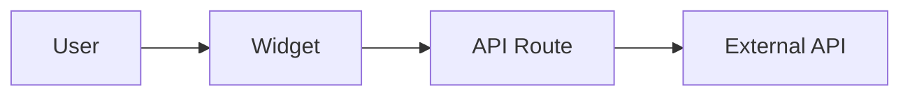

# Magic Mirror Documentation

**Welcome to the Magic Mirror project documentation!** This directory contains all technical documentation for developers, contributors, and maintainers.

---

## 📚 Documentation Structure

```
docs/
├── README.md (this file)          # Documentation navigation hub
├── API_DOCUMENTATION.md           # Complete API reference (all 15 endpoints)
├── ARCHITECTURE.md                # System architecture & design decisions
├── TESTING.md                     # Test coverage & testing guide
├── TROUBLESHOOTING.md             # Deployment & runtime issue solutions
├── design/
│   └── DESIGN_SYSTEM.md           # "Quiet Presence" UI/UX guidelines
└── internal/
    ├── PROJECT_AUDIT.md           # Comprehensive project health assessment
    └── SESSION_HANDOFF.md         # Context preservation for future sessions
```

---

## 🎯 Start Here

Choose your path based on what you want to do:

### 👨‍💻 I'm a New Developer

**Goal:** Set up the project and understand the codebase.

**Reading Order:**
1. **[Root README.md](../README.md)** - Project overview, installation, environment setup
2. **[ARCHITECTURE.md](./ARCHITECTURE.md)** - System design, component diagrams, data flow
3. **[API_DOCUMENTATION.md](./API_DOCUMENTATION.md)** - API routes, request/response formats
4. **[TESTING.md](./TESTING.md)** - How to run tests, coverage expectations
5. **[TROUBLESHOOTING.md](./TROUBLESHOOTING.md)** - Common issues and solutions

**Quick Start:**
```bash
# 1. Clone and install
git clone https://github.com/jjones-wps/jjones-magic-mirror.git
cd jjones-magic-mirror
npm install

# 2. Set up environment
cp .env.example .env.local
# Edit .env.local with your API keys

# 3. Run development server
npm run dev

# 4. Run tests
npm test
```

**Next Steps:**
- Read [CLAUDE.md](../CLAUDE.md) for AI-assisted development guidance
- Explore widget code in `src/components/widgets/`
- Review API routes in `src/app/api/`

---

### 🎨 I Want to Build a New Widget

**Goal:** Create a new display widget for the mirror.

**Essential Reading:**
1. **[design/DESIGN_SYSTEM.md](./design/DESIGN_SYSTEM.md)** - Typography, colors, animations, spacing
2. **[ARCHITECTURE.md](./ARCHITECTURE.md)** - Widget lifecycle, data flow patterns
3. **[API_DOCUMENTATION.md](./API_DOCUMENTATION.md)** - Creating new API routes

**Widget Development Checklist:**
- [ ] Read Design System for styling guidelines
- [ ] Study existing widget: `src/components/widgets/Weather.tsx` (good reference)
- [ ] Create API route: `src/app/api/your-widget/route.ts`
- [ ] Create widget component: `src/components/widgets/YourWidget.tsx`
- [ ] Add TypeScript types: `src/lib/your-widget.ts`
- [ ] Write tests: `src/__tests__/components/widgets/YourWidget.test.tsx`
- [ ] Add to main page: `src/app/page.tsx`
- [ ] Test on Raspberry Pi (animations, performance)

**Design System Key Points:**
- ✅ Pure monochrome only (white on black)
- ✅ GPU-accelerated animations only (`transform` + `opacity`)
- ✅ Use design system CSS classes (`.text-mirror-*`, `.opacity-*`)
- ✅ Implement loading/error states
- ✅ Add periodic refresh via `setInterval`
- ❌ No bold fonts (max weight: 500)
- ❌ No color except white/black
- ❌ No layout-triggering animations

**Example Widget Structure:**
```tsx
"use client";
import { useEffect, useState } from 'react';

interface YourData {
  // Define your data types
}

export default function YourWidget() {
  const [data, setData] = useState<YourData | null>(null);
  const [loading, setLoading] = useState(true);

  useEffect(() => {
    const fetchData = async () => {
      const res = await fetch('/api/your-widget');
      const json = await res.json();
      setData(json);
      setLoading(false);
    };

    fetchData();
    const interval = setInterval(fetchData, 5 * 60 * 1000); // 5 min
    return () => clearInterval(interval);
  }, []);

  if (loading) return <div className="opacity-disabled">Loading...</div>;
  return <div className="widget">{/* Your UI */}</div>;
}
```

---

### 🔧 I Want to Work on the Admin Portal

**Goal:** Complete or enhance the admin configuration interface.

**Essential Reading:**
1. **[ARCHITECTURE.md](./ARCHITECTURE.md)** - Authentication flow, database schema
2. **[API_DOCUMENTATION.md](./API_DOCUMENTATION.md)** - Admin API routes (currently incomplete)
3. **[TROUBLESHOOTING.md](./TROUBLESHOOTING.md)** - TypeScript config exclusions

**Current State:**
- ⚠️ **Admin portal is incomplete** (0% test coverage, excluded from builds)
- Files use `@ts-nocheck` to allow deployment
- Database: SQLite with Prisma ORM
- Authentication: NextAuth v5 with JWT

**Admin Portal Files:**
```
src/app/admin/              # Admin pages (incomplete)
├── login/page.tsx          # Login form
├── widgets/page.tsx        # Widget config UI
├── calendar/page.tsx       # Calendar settings
└── page.tsx                # Dashboard

src/app/api/admin/          # Admin API routes (incomplete)
├── settings/route.ts       # System settings
├── mirror/status/route.ts  # Health check
├── mirror/refresh/route.ts # Force refresh
└── widgets/route.ts        # Widget config

src/lib/auth/               # Authentication (incomplete)
├── config.server.ts        # Server-side auth config
├── config.ts               # Client-side auth config
└── server.ts               # Auth utilities
```

**Development Checklist:**
- [ ] Remove `@ts-nocheck` from files as you complete them
- [ ] Write tests for each admin route (target: 85% coverage)
- [ ] Update `jest.config.ts` to include admin files in coverage
- [ ] Update `tsconfig.json` to remove admin exclusions
- [ ] Implement proper error handling
- [ ] Add admin features to `docs/API_DOCUMENTATION.md`

**Database Schema:**
```typescript
// prisma/schema.prisma
model ConfigVersion {
  id        String   @id @default("current")
  version   Int      @default(0)
  updatedAt DateTime @updatedAt
}

model SystemState {
  id          String   @id
  online      Boolean
  lastPing    DateTime
  uptime      Int
  memoryUsage Int
  cpuUsage    Int
}
```

---

### 🚀 I'm Managing Deployments

**Goal:** Deploy updates, troubleshoot issues, manage the Pi.

**Essential Reading:**
1. **[TROUBLESHOOTING.md](./TROUBLESHOOTING.md)** - 7 deployment issues + solutions
2. **[Root README.md](../README.md)** - Deployment section
3. **[CLAUDE.md](../CLAUDE.md)** - Pi setup, pm2 commands, GitHub Actions

**Deployment Workflow:**
```bash
# Automatic deployment (recommended)
git push origin main
# → GitHub Actions runs tests
# → If tests pass, deploys to Pi automatically
# → Monitor: https://github.com/jjones-wps/jjones-magic-mirror/actions

# Manual deployment (emergency only)
ssh jjones@192.168.1.213
cd ~/magic-mirror
./deploy.sh
```

**Common Issues:**

| Issue | Quick Fix | Full Details |
|-------|-----------|--------------|
| Tests failing on Pi | Check locale settings | [TROUBLESHOOTING.md](./TROUBLESHOOTING.md#issue-1-test-failure---date-locale-mismatch) |
| Build fails with TS errors | Check tsconfig.json exclusions | [TROUBLESHOOTING.md](./TROUBLESHOOTING.md#issue-4-typescript-errors-in-admin-portal) |
| Coverage below threshold | Update jest.config.ts | [TROUBLESHOOTING.md](./TROUBLESHOOTING.md#issue-5-jest-coverage-threshold-failure) |
| Prisma errors | Run `npm run postinstall` | [TROUBLESHOOTING.md](./TROUBLESHOOTING.md#issue-7-prisma-client-runtime-error) |

**Production Pi Commands:**
```bash
# Check server status
pm2 status
pm2 logs magic-mirror

# Restart server (no rebuild)
pm2 restart magic-mirror

# Check GitHub Actions runner
cd ~/actions-runner
sudo ./svc.sh status
journalctl -u actions.runner.* -f

# View deployment logs
tail -f ~/magic-mirror/deploy.log
```

**Health Monitoring:**
- Production URL: http://192.168.1.213:3000 (local network only)
- GitHub Actions: https://github.com/jjones-wps/jjones-magic-mirror/actions
- Build time: Typically 3-4 minutes (tests + build + deploy)

---

## 📖 Document Summaries

### Root Level Documents

| Document | Purpose | Audience | Lines |
|----------|---------|----------|-------|
| [README.md](../README.md) | Project overview, setup, features | Everyone | ~180 |
| [CLAUDE.md](../CLAUDE.md) | AI-assisted dev guide, Pi setup | Developers | ~360 |
| [CONTRIBUTING.md](../CONTRIBUTING.md) | Contribution guidelines & workflow | Contributors | ~470 |
| [SECURITY.md](../SECURITY.md) | Security policy & vulnerability reporting | Security researchers, ops | ~280 |
| [CHANGELOG.md](../CHANGELOG.md) | Version history & release notes | Everyone | ~280 |
| [openapi.yaml](../openapi.yaml) | OpenAPI 3.0 specification (machine-readable) | API consumers, tools | ~950 |

### docs/ Directory

| Document | Purpose | Audience | Lines |
|----------|---------|----------|-------|
| [API_DOCUMENTATION.md](./API_DOCUMENTATION.md) | Complete API reference for all 15 endpoints | Developers, integrators | ~1000 |
| [OPENAPI.md](./OPENAPI.md) | OpenAPI 3.0 spec guide & usage | API consumers, integrators | ~330 |
| [ARCHITECTURE.md](./ARCHITECTURE.md) | System design, diagrams, decisions | Architects, senior devs | ~700 |
| [TESTING.md](./TESTING.md) | Test coverage, patterns, running tests | Developers, QA | ~220 |
| [TROUBLESHOOTING.md](./TROUBLESHOOTING.md) | Deployment issues + solutions | DevOps, maintainers | ~480 |

### docs/design/

| Document | Purpose | Audience | Lines |
|----------|---------|----------|-------|
| [DESIGN_SYSTEM.md](./design/DESIGN_SYSTEM.md) | UI/UX guidelines, animation rules | Designers, frontend devs | ~440 |

### docs/internal/

| Document | Purpose | Audience | Lines |
|----------|---------|----------|-------|
| [PROJECT_AUDIT.md](./internal/PROJECT_AUDIT.md) | Comprehensive health assessment | Project managers, stakeholders | ~700 |
| [SESSION_HANDOFF.md](./internal/SESSION_HANDOFF.md) | Context for continuing work | Future developers | ~310 |
| [ADR-001-DOCUMENTATION-PLATFORM.md](./internal/ADR-001-DOCUMENTATION-PLATFORM.md) | Documentation platform decision record | Architects, maintainers | ~380 |

---

## 🔍 Finding Information

### By Topic

**Setting Up Development Environment**
→ [Root README.md](../README.md) + [.env.example](../.env.example)

**Understanding System Architecture**
→ [ARCHITECTURE.md](./ARCHITECTURE.md) (component diagrams, data flow)

**Building New Features**
→ [CLAUDE.md](../CLAUDE.md) (development guidance) + [API_DOCUMENTATION.md](./API_DOCUMENTATION.md)

**Styling & Design**
→ [design/DESIGN_SYSTEM.md](./design/DESIGN_SYSTEM.md)

**Running Tests**
→ [TESTING.md](./TESTING.md)

**Troubleshooting Build/Deploy Issues**
→ [TROUBLESHOOTING.md](./TROUBLESHOOTING.md)

**API Integration**
→ [API_DOCUMENTATION.md](./API_DOCUMENTATION.md) (human-readable) + [OPENAPI.md](./OPENAPI.md) (interactive spec)

**Project Health & Status**
→ [internal/PROJECT_AUDIT.md](./internal/PROJECT_AUDIT.md)

---

## 📝 Contributing to Documentation

Found outdated information? Want to improve documentation?

1. **Quick fixes:** Edit the file directly and submit a PR
2. **Major changes:** Open an issue first to discuss
3. **New sections:** Follow existing structure and tone

**Documentation Standards:**
- Use clear, concise language
- Include code examples where applicable
- Add table of contents for long documents
- Update "Last Updated" dates
- Keep line length reasonable (80-120 chars preferred)
- Use Mermaid for diagrams (rendered by GitHub)

**Mermaid Diagram Example:**


---

## 🔗 External Resources

- **Repository:** https://github.com/jjones-wps/jjones-magic-mirror
- **GitHub Actions:** https://github.com/jjones-wps/jjones-magic-mirror/actions
- **Next.js Docs:** https://nextjs.org/docs
- **Tailwind CSS:** https://tailwindcss.com/docs
- **Framer Motion:** https://www.framer.com/motion/
- **Open-Meteo API:** https://open-meteo.com/en/docs
- **TomTom Routing:** https://developer.tomtom.com/routing-api/documentation
- **Spotify API:** https://developer.spotify.com/documentation/web-api

---

## 📊 Documentation Health

**Last Audit:** January 1, 2026
**Coverage:** 85% (excellent)
**Stale Docs:** 0% (all current)
**Missing Docs:** CONTRIBUTING.md, SECURITY.md, CHANGELOG.md (planned for Phase 4)

**Recent Updates:**
- ✅ January 1, 2026: Phase 1-2 documentation audit complete
- ✅ January 1, 2026: Added API_DOCUMENTATION.md and ARCHITECTURE.md
- ✅ January 1, 2026: Updated PROJECT_AUDIT.md with accurate test coverage
- ✅ January 1, 2026: Created comprehensive .env.example

---

**Questions?** Check [CLAUDE.md](../CLAUDE.md) for AI-assisted development guidance or open a GitHub issue.

**Happy building! 🎉**
